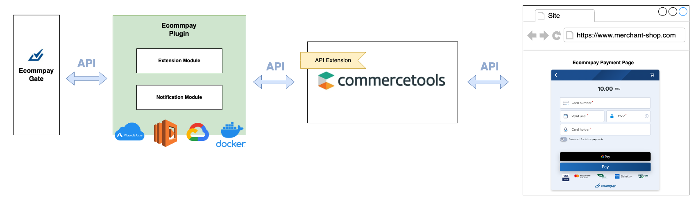
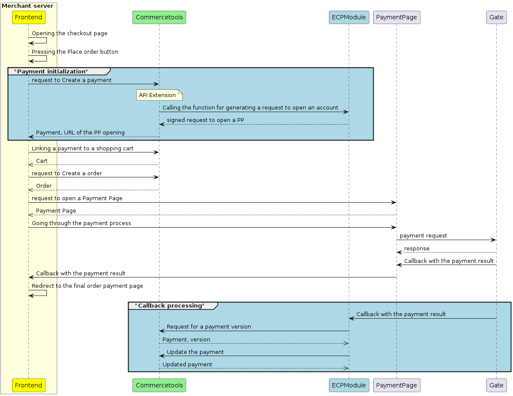
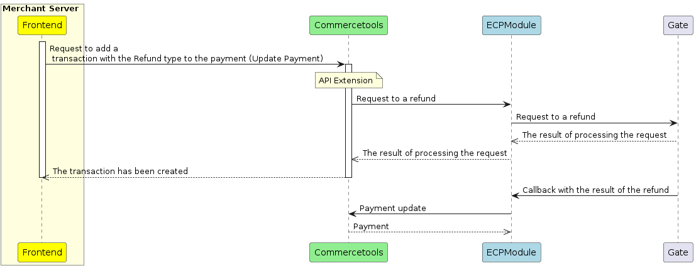

# Ecommpay Commercetools modules Integration

## Supported features
- Generate URL [Ecommpay Payment Page](https://developers.ecommpay.com/en/en_PP_general.html#en_PP_genera) for one-step purchase.
- Processing [callbacks](https://developers.ecommpay.com/en/en_Gate_Callbacks.html?hl=callback) from Ecommpay Platform, and update payments in Commercetools.
- Refund a payment back to the shopper.

## Overview
This plugin simplifies integration with Ecommpay of merchants using the Commercetools platform. The plugin contains the following modules:
- **Extension module** - URL generation module for opening the Payment Page and performing refund operations
- **Notification module** - Ecommpay Gate callback processing module and updating payment information in Commercetools.

The modules are implemented as a "function as a service". It is possible to place these modules in a local or cloud service (AWS Lambda, Azure Functions or Google Cloud Functions). For modules to interact with Commercetools, the [API Extensions](https://docs.commercetools.com/api/projects/api-extensions) should be used, which, under certain triggers, will access the functions of the plug-in modules.


When creating or updating a payment, Commercetools will call the Extension Module to generate a link to the Payment Page. The Payment Page link supports all additional parameters for opening the payment page. If you need to open the Payment Page with [additional parameters](https://developers.ecommpay.com/en/en_PP_Parameters.html) (including fields in the Billing Address section), they must be passed in the request to create or update a payment in the custom **"initial_request"** field.
```json
{
  "custom": {
    "type": {
      "typeId": "type",
      "key": "ecommpay-integration"
    },
    "fields": {
      "initial_request": "\"{\\\"customer_id\\\":123,\\\"billing_country\\\":\\\"DE\\\",\\\"customer_country\\\":\\\"DE\\\"}\""
    }
  }
}
```

## Purchase
After receiving the Payment Page URL, you need to open the page using one of the described methods:
- [Opening Payment Page as a separate HTML page](https://developers.ecommpay.com/en/en_PP_method_NewTab.html#en_PP_method_NewTab)
- [Opening Payment Page in a modal window](https://developers.ecommpay.com/en/en_PP_method_ModalWindow.html#en_PP_method_ModalWindow)
- [Opening Payment Page in an iframe element of an HTML page](https://developers.ecommpay.com/en/en_PP_method_Embedded.html#en_PP_method_Embedded)

Next, you need to link the payment to the order yourself using the API Commercetools.

The Notification module will process the callback-notification from Ecommpay Gate and update the information in the payment.


Example flow:


## Refund
To make a refund, you must send a request to Commercetools to [update the payment](https://docs.commercetools.com/api/projects/payments#update-payment) with the Refund transaction type.
```json
{
  "version": 1,
  "actions": [
    {
      "action": "addTransaction",
      "transaction": {
        "type": "Refund",
        "amount": {
          "centAmount": 8300,
          "currencyCode": "EUR"
        }
      }
    }
  ]
}
```
Next, the Extension Module will make a refund request to Ecommpay Gate.



## Implementation
### API Client
In order for  ECP modules to send requests to the project in Commetcetools, you need to configure the [API Client](https://docs.commercetools.com/merchant-center/api-clients) in your commercetools project with access to the following grants:
- manage_payments
- manage_types

### General recommendations
1. Submit the application for connecting to the payment platform, provide all necessary information, and receive a notification from ecommpay about the possibility to process payments.
2. Create zip archive(s) with extension and notification functions.
3. Create the notification function on one of the cloud platforms with the environment variable ([ECP_PARAMETERS](/docs/resources/notification_env.json)). Create and get this endpoint URL (this is the callback URL). Pay attention to the timeout value, it should be more than 15 seconds.
4. Create the extension function on one of the cloud platforms with the environment variable ([ECP_PARAMETERS](/docs/resources/extension_env.json)). Create and get this endpoint URL (this is the URL for Commercetools).
5. Upload [payment-interface-interaction](/docs/resources/payment-interface-interaction.json) and [payment extension](/docs/resources/payment.json) into Commercetools.
6. Upload [API extension](/docs/resources/api-extension.json) with the URL received in point 4. **We strongly recommend enabling authentication with your cloud platform** (how to do it see [here](https://docs.commercetools.com/tutorials/extensions#setting-up-an-api-extension))
7. Add ecompay payment methods, [script](https://paymentpage.ecommpay.com/shared/merchant.js) and [styles](https://paymentpage.ecommpay.com/shared/merchant.css) to your store and pass "ecommpay-integration" value in the paymentMethodInfo.paymentInterface when creating payment. You can also pass the custom field "initial_request" with additional parameters for the payment page. After creating the payment, direct the user to the payment page.


### Multiple platform deployment
Deploy the modules in one of the following ways:
- ### [Deployment as a Node web server](docs/deployment/as-Node-Server.md)
- ### [Deployment as a Docker containers](docs/deployment/as-Docker-Container.md)
- ### [Deployment as an Amazon Lambda Serverless Function](docs/deployment/as-AWS-Lambda.md)
- ### [Deployment as an Azure Cloud Serverless Function](docs/deployment/as-Azure-Serverless.md)
- ### [Deployment as a GCP Function](docs/deployment/as-GCP-Function.md)

### Environment variables
|Parameter|Format|Description|
|-|--------|---|
|CT_PROJECT_ID|String|Your commercetools Project Key is required to communicate with commercetools. The project key is also the name of your commercetools project.|
|CT_CLIENT_ID|String|The API Client ID is required to communicate with commercetools.|
|CT_CLIENT_SECRET|String|The Client Secret API client is required to communicate with commercetools.|
|CT_AUTH_URL|String|The Auth URL API client is required to communicate with commercial tools (default value is https://auth.europe-west1.gcp.commercetools.com).|
|CT_API_URL|String|The API client API URL is required to communicate with commercial tools (default value is https://api.europe-west1.gcp.commercetools.com).|
|ECP_PROJECT_ID|INT|Ecommpay Project ID|
|ECP_SECRET_KEY|String|The secret key of the Ecommpay project|
|CALLBACK_URL|String|URL for receiving notifications from the Ecommpay platform|
|EXTENSION_LOGIN|string|This parameter is for deploying as a node server or docker|
|EXTENSION_PASSWORD|string|This parameter is for deploying as a node server or docker|

### Custom types
Set [custom types](https://docs.commercetools.com/api/projects/types#create-type)  to be able to save the payment information of Ecommpay transactions in the payment object.

For Payment interface interaction object:
```json
{
  "key": "ecommpay-integration-interaction-payment-type",
  "name": {
    "en": "commercetools Ecommpay integration payment interface interaction type"
  },
  "resourceTypeIds": ["payment-interface-interaction"],
  "fieldDefinitions": [
    {
      "name": "operation_id",
      "label": {
        "en": "Operation id"
      },
      "required": false,
      "type": {
        "name": "Number"
      },
      "inputHint": "SingleLine"
    },
    {
      "name": "operation_type",
      "label": {
        "en": "Operation type"
      },
      "required": false,
      "type": {
        "name": "String"
      },
      "inputHint": "SingleLine"
    },
    {
      "name": "operation_status",
      "label": {
        "en": "Operation status"
      },
      "required": false,
      "type": {
        "name": "String"
      },
      "inputHint": "SingleLine"
    },
    {
      "name": "date",
      "label": {
        "en": "Date"
      },
      "required": false,
      "type": {
        "name": "DateTime"
      },
      "inputHint": "SingleLine"
    },
    {
      "name": "sum_initial",
      "label": {
        "en": "Sum initial"
      },
      "required": false,
      "type": {
        "name": "String"
      },
      "inputHint": "SingleLine"
    },
    {
      "name": "sum_converted",
      "label": {
        "en": "Sum converted"
      },
      "required": false,
      "type": {
        "name": "String"
      },
      "inputHint": "SingleLine"
    },
    {
      "name": "message",
      "label": {
        "en": "Message"
      },
      "required": false,
      "type": {
        "name": "String"
      },
      "inputHint": "SingleLine"
    }
  ]
}
```

For Payment object:
```json
{
  "key": "ecommpay-integration",
  "name": {
    "en": "commercetools ecommpay integration"
  },
  "resourceTypeIds": ["payment"],
  "fieldDefinitions": [
        {
      "name": "initial_request",
      "label": {
        "en": "Initial request"
      },
      "type": {
        "name": "String"
      },
      "inputHint": "SingleLine",
      "required": false
    },
    {
      "name": "pp_url",
      "label": {
        "en": "Payment Page URL"
      },
      "type": {
        "name": "String"
      },
      "inputHint": "SingleLine",
      "required": false
    }
  ]
}
```

### API Extension

> **We strongly recommend enabling authentication with your cloud platform** (how to do it see [here](https://docs.commercetools.com/tutorials/extensions#setting-up-an-api-extension)) \
> If you deploy the extension module as a standalone server you should use the header authorization.

Set the [API Extension](https://docs.commercetools.com/api/projects/api-extensions#create-extension) to create a payment with JSON:
```json
{
  "key": "ecommpay-integration-payment-extension",
  "destination": {
    "type": "HTTP",
    "url": "${ExtensionUrl}"
  },
  "triggers": [
    {
      "resourceTypeId": "payment",
      "actions": ["Create","Update"],
      "condition": "paymentMethodInfo is defined AND paymentMethodInfo(paymentInterface is defined) AND paymentMethodInfo(paymentInterface=\"ecommpay-integration\")"
    }
  ],
  "timeoutInMs": 10000
}
```